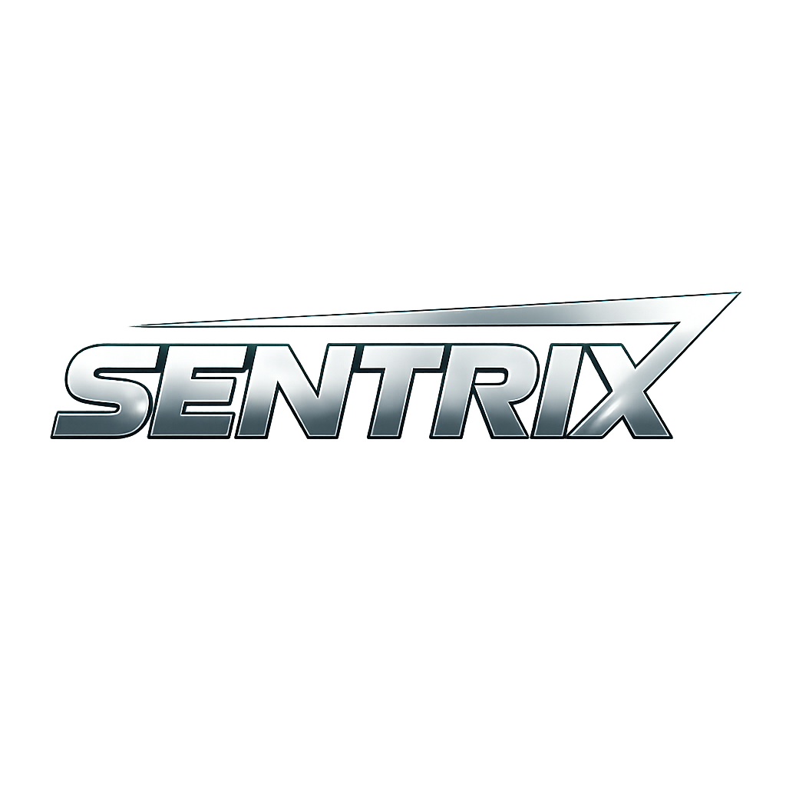

<div align="center">


<br/>


&nbsp;

&nbsp;


</div>

<br/>

# Hey there! 👋

I'm **Cloud_wiz**,

### Founder & CEO — Sentrix  
**Embedded Systems • AI-Driven Engineering • Secure Hardware Architect**

<p align="center">
  
  
  
</p>

</div>

---

## 🧠 About

I am the founder of **Sentrix**, an independent hardware initiative based in India focused on building secure, purpose-driven embedded systems and modern cybersecurity-oriented hardware platforms.

My work combines:

- System-level embedded architecture  
- AI-assisted firmware workflows  
- Production-grade PCB design  
- Secure hardware principles  

Sentrix operates independently — built with clarity, discipline, and long-term technical vision.

---

## ⚙️ Technical Domain

```yaml
Specialization:
  - Embedded System Architecture
  - IoT Device Engineering
  - Secure Hardware Design
  - PCB Design (Prototype → Production)
  - Firmware Optimization

Workflow Integration:
  - AI-assisted engineering refinement
  - Learning-driven system design
  - Practical hardware deployment pipelines
```

---

## 📊 Engineering Focus Metrics

- Performance-first embedded firmware  
- Security-driven system architecture  
- Independent R&D execution  
- Prototype → production-ready workflows  
- IoT connectivity & device orchestration  

---

## 🧭 Current Direction

- Designing advanced secure embedded platforms  
- Refining AI-integrated hardware development workflows  
- Building scalable, learning-driven hardware systems  

---

## 🧩 Engineering Principles

- Clarity in design  
- Security by intention  
- Function before complexity  
- Built and refined independently  

---

## 📈 GitHub Analytics

<p align="center">
  
</p>

<p align="center">
  
</p>

---

<div align="center">

Secure • Functional • Future-Ready  

📫 sentrix.org@gmail.com  

</div>

---

## 🌐 Connect

<div align="center">

<a href="https://github.com/Sentrix-wiz">GitHub</a> • 
<a href="https://instagram.com/YOUR_USERNAME">Instagram</a> • 
<a href="https://youtube.com/@YOUR_CHANNEL">YouTube</a> • 
<a href="https://twitter.com/YOUR_USERNAME">X</a> • 
<a href="https://discord.gg/YOUR_INVITE">Discord</a>

</div>
```

---

## `Engineering_focus.md`

<div align="center">

| Domain | Focus | Approach |
|:---|:---:|:---:|
| Embedded Firmware | Performance-First | Constrained Optimization |
| System Architecture | Security-Driven | Secure by Design |
| R&D Execution | Independent | Self-Directed |
| Build Pipeline | End-to-End | Prototype → Production |
| Device Connectivity | IoT Orchestration | LoRa / BLE / MQTT |

</div>


---

# `current_direction.log`

```
[ACTIVE]  Designing advanced secure embedded platforms
[ACTIVE]  Refining AI-integrated hardware development workflows
[ACTIVE]  Building scalable, learning-driven hardware systems
```

<br/>
---

## 🧩 Engineering Principles

- Clarity in design  
- Security by intention  
- Function before complexity  
- Built and refined independently  

---

## 📈 GitHub Analytics

<p align="center">
  
</p>

<p align="center">
  
</p>

---

<div align="center">

Secure • Functional • Future-Ready  

📫 sentrix.org@gmail.com  

</div>

---

## 🌐 Connect

<div align="center">

<a href="https://github.com/Sentrix-wiz">GitHub</a> • 
<a href="https://instagram.com/YOUR_USERNAME">Instagram</a> • 
<a href="https://youtube.com/@YOUR_CHANNEL">YouTube</a> • 
<a href="https://twitter.com/YOUR_USERNAME">X</a> • 
<a href="https://discord.gg/YOUR_INVITE">Discord</a>

</div>
